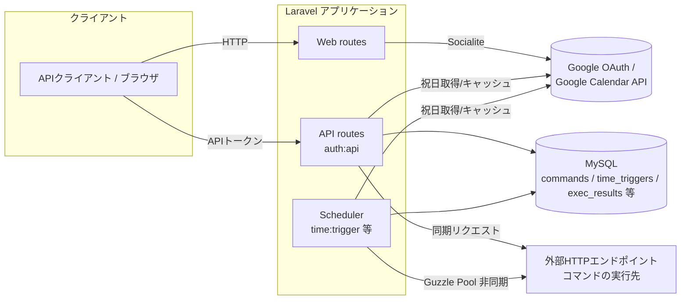

# アーキテクチャ

この文書は、継続的な開発・運用向けに現在の実装構成を整理したものである。詳細な調査ログは [`current-architecture.md`](current-architecture.md)（Issue #208時点の棚卸し）を土台とし、Issue #210〜#222の変更を反映して現在形に更新している。API一覧・テーブル一覧などの詳細は複製せず、`current-architecture.md`と実装コードへリンクする。

## 1. システム全体の責務

本アプリケーションは、ユーザーまたはグループに紐づく外部HTTPリクエスト定義（コマンド）を、API経由の手動実行、または時刻・曜日・祝日条件に基づく定期実行（時間トリガー）で呼び出すLaravelアプリケーションである。Google認証によるユーザー・グループ登録、Google Calendar由来の祝日情報とユーザーまたはグループ単位の個別カレンダー上書き、ワンタイムスキップ、実行結果の保存を責務として持つ。

責務の詳細と対象外機能（SSID関連、FCM通知送信、端末モード変更、キュー非同期処理等）の一覧は [`current-architecture.md` の「2. アプリケーションの責務」「3. 対象外または未実装の機能」](current-architecture.md#2-アプリケーションの責務) を参照する。

## 2. エントリーポイント

### 2.1 HTTP

- Webルート（認証なし）: ルート状態確認、祝日キャッシュクリア、Google認証リダイレクト／コールバック、ReDoc表示（`src/routes/web.php`）。
- APIルート（`auth:api` トークンガード必須）: コマンドCRUD、コマンド・まとめコマンドの実行、休日判定・個別カレンダー登録、実行結果取得、ワンタイムスキップ（`src/routes/api.php`）。
- 認証は `config/auth.php` で `guard: token` を使うシンプルなAPIトークン方式（`users.api_token`）であり、Laravel Sanctum等のセッション/SPA認証は使用しない（`laravel/sanctum`はIssue #217で未使用のため削除済み）。

エンドポイント一覧は [`current-architecture.md` の「5. HTTPエントリーポイント」](current-architecture.md#5-httpエントリーポイント) を参照する。

### 2.2 Artisanコマンド / Scheduler

`src/app/Console/Kernel.php` が次の3コマンドをLaravel Schedulerへ登録する。

| コマンド | 頻度 | 処理 |
| --- | --- | --- |
| `holidays:update` | 毎月 | 祝日ファイルキャッシュを削除し、日本の当年・翌年分を再取得する |
| `time:trigger` | 毎分 | 実行対象の時間トリガーを抽出し、外部HTTPリクエストを非同期実行する |
| `results:delete` | 毎時 | コマンドごとに最新100件を残し、古い実行結果を物理削除する |

これらを起動するOS側のcron・systemd timer等はリポジトリに含まれない。本番での起動方法は未確認（[`current-operations.md` 5.5](current-operations.md)）。

## 3. Laravel / MySQL / 外部サービスの境界

- Laravelアプリケーションが唯一のバックエンドであり、Web/API/Artisanのいずれも同一コードベース・同一DB接続を使う。
- 外部連携はGoogle（認証・Calendar）と、コマンドに登録された任意の外部HTTPエンドポイントの2系統。
- DBアクセスはEloquentモデル経由が中心だが、`time:trigger`の対象抽出はタイムゾーン変換・休日結合を含む生SQL（`DB::select`）を使う（[`current-architecture.md` 7.4](current-architecture.md)）。

## 4. Google認証

- `GoogleLoginController`（`src/app/Http/Controllers/Web/GoogleLoginController.php`）が Laravel Socialite の `google` ドライバでOAuthを扱う。
- フロー: `/auth/redirect` → Google認証画面 → `/login/callback`（stateless）→ Googleユーザー情報のメールアドレスで `groups` をupsert → グループ所有者ユーザーが未登録なら60文字ランダムなAPIトークンを持つ `users` を作成 → APIトークン等をJSONで返す。
- 認証後のAPI呼び出しは、この場で払い出されたAPIトークンを `auth:api`（tokenガード）で検証する方式であり、Googleトークン自体はAPI認証には使わない。
- `GoogleLoginController::apiLogin()`（Googleトークンからの直接ログイン）にはルートが割り当てられておらず、現在到達不能（[`current-architecture.md` 7.1](current-architecture.md)）。

## 5. Google Calendar

- `src/app/Libs/HolidayList.php` が、国コード・年ごとにGoogle Calendar APIの祝日カレンダー（`https://www.googleapis.com/calendar/v3/calendars/...`）を取得する。
- 取得結果は `logs/holidays.json` にファイルキャッシュし、同じ国・年の次回参照時はAPIを呼ばずキャッシュを返す。
- キャッシュは `holidays:update`（毎月、日本のみ）と `/holiday/cache/clear`（手動、全件クリア）で更新される。
- 休日判定APIおよび`time:trigger`は、まずこのGoogle Calendar結果を参照し、対象ユーザー/グループの `calenders`（個別カレンダー）に上書きがあればそちらを優先する。優先関係の詳細は [`docs/domain.md`](domain.md) を参照する。

## 6. 外部HTTP実行

コマンド（`commands`テーブル）はHTTPメソッド・URL・本文形式・ヘッダー・パラメーターを保持し、2つの経路で実行される。

| 経路 | 契機 | 実行方式 | 結果の扱い |
| --- | --- | --- | --- |
| 手動実行 | `POST /api/exec/command/{id}`、`POST /api/exec/summary/{id}` | Guzzle同期リクエスト | APIレスポンスとして返す（`exec_results`には保存しない） |
| 時間トリガー実行 | `time:trigger`（毎分） | Guzzle Pool非同期リクエスト | `exec_results`に保存する |

いずれも `Guzzle\Client` を使い、パラメーター中の `##DATETIME##` をPHPサーバーの現在日時で置換し、リダイレクトを許可して外部URLへリクエストする。詳細な分岐（`body_type`ごとの扱い、認可確認の非対称性等）は [`docs/domain.md`](domain.md) と [`current-architecture.md` 7.3〜7.4](current-architecture.md) を参照する。

## 7. DBとの関係

- スキーマはLaravelマイグレーションではなく、`docker/db/sql/*.sql` がローカルMySQLコンテナの初回起動時にのみ適用する。既存DBへの差分適用経路はリポジトリ内にない。
- テーブル間の関連はID値による論理参照であり、外部キー制約はない。`target_id`/`target_type` の組でユーザーまたはグループを表現する（ポリモーフィックな所有権表現）。
- Eloquentモデルは総じて薄く（`$guarded = ['id']` とhidden属性程度）、業務ロジックはController・Console Command側に置かれている。
- モデルは `SoftDeletes` を使用せず、論理削除（`deleted_at`設定）と物理削除（`delete()`）が処理ごとに混在する。
- テーブル一覧・列詳細は [`current-architecture.md` の「9. データベース」](current-architecture.md#9-データベース) を参照する。

## 8. ローカル・CI・本番の構成差

| 項目 | ローカル | CI（GitHub Actions） | 本番 |
| --- | --- | --- | --- |
| PHP | Docker上のPHP 8.5.9（`docker/web/Dockerfile`既定） | ローカルと同じ`make check`でPHP 8.5.9を機械的に検証 | XServer上でPHP 8.2.30のまま（Issue #226で切り替え予定。composer.jsonの最低要件`^8.3`のため、切り替えまでこのLaravel 13版をデプロイしてはならない） |
| Webサーバー | Apache（Dockerイメージ） | Apache（`make check`と同一構成） | 公開経路の応答ヘッダーは`nginx`（PHPへの接続方式は未確認） |
| DB | MySQL 5.7.35（Docker、named volumeで永続化） | MySQL 5.7.35（`docker-compose.check.yml`、使い捨て） | 未確認（`SELECT NOW()`が日本時間で応答することのみ確認済み） |
| 実行方式 | `make up`/`make check`でDocker Compose起動 | `make check`（検証専用Compose project） | GitHub ActionsからSSH+rsyncで`src`を配備（`v*`タグpush時のみ、`.github/workflows/deploy.yaml`） |
| スキーマ適用 | コンテナ初回起動時に`docker/db/sql`を適用 | 同左（使い捨てDBに毎回適用） | 適用方法・実スキーマ未確認 |
| Scheduler起動 | 手順なし（READMEに記載なし） | 該当なし | OS側の登録内容未確認 |

差異の背景・未確認事項の詳細は [`current-operations.md`](current-operations.md) を参照する。`make check` によるローカル/CI検証環境の分離（Issue #233）については同文書 2.7節を参照する。

## 9. 関連ドキュメント

- 詳細な実装棚卸し: [`current-architecture.md`](current-architecture.md)
- 運用・本番情報の詳細: [`current-operations.md`](current-operations.md)
- ドメインルール: [`domain.md`](domain.md)
- 秘密情報の管理: [`secrets-management.md`](secrets-management.md)
- 依存関係更新（Dependabot）運用: [`dependency-updates.md`](dependency-updates.md)
- AIエージェント向け作業ルール: [`../AGENTS.md`](../AGENTS.md)
